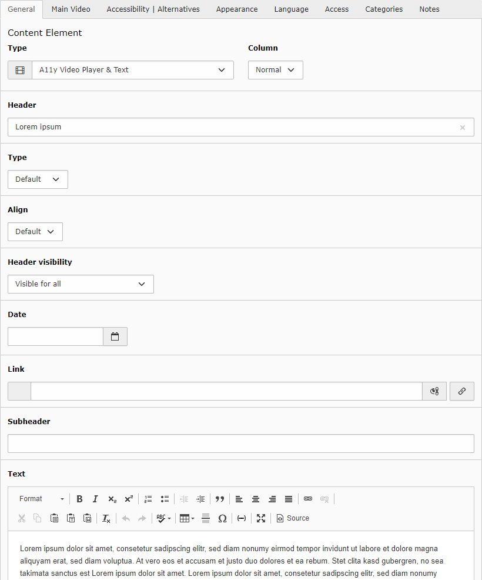
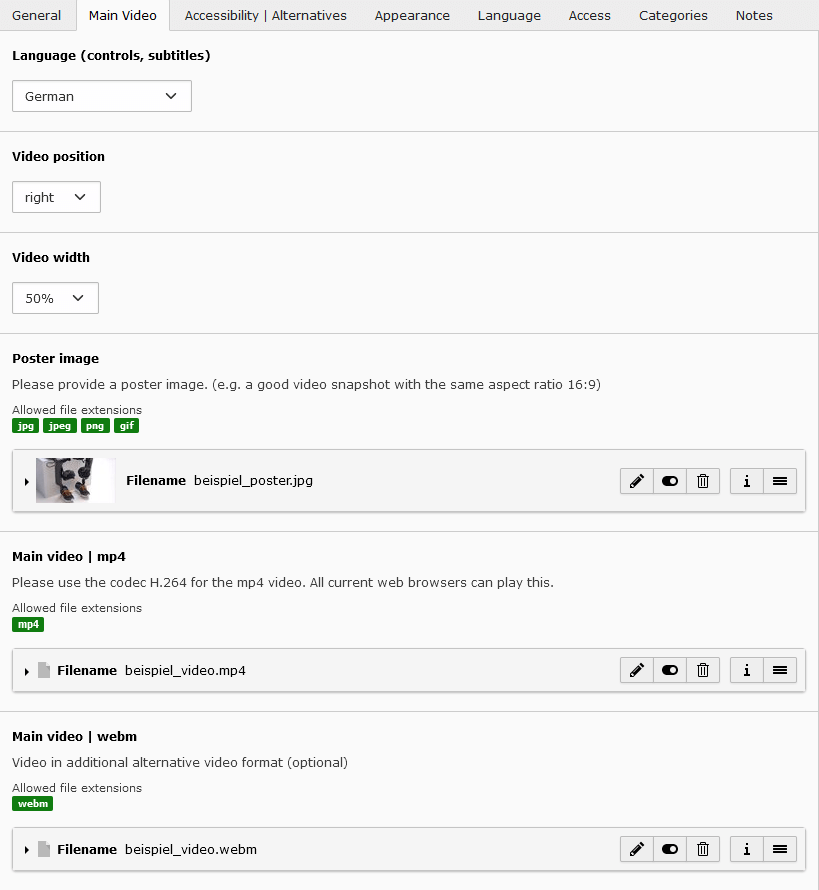
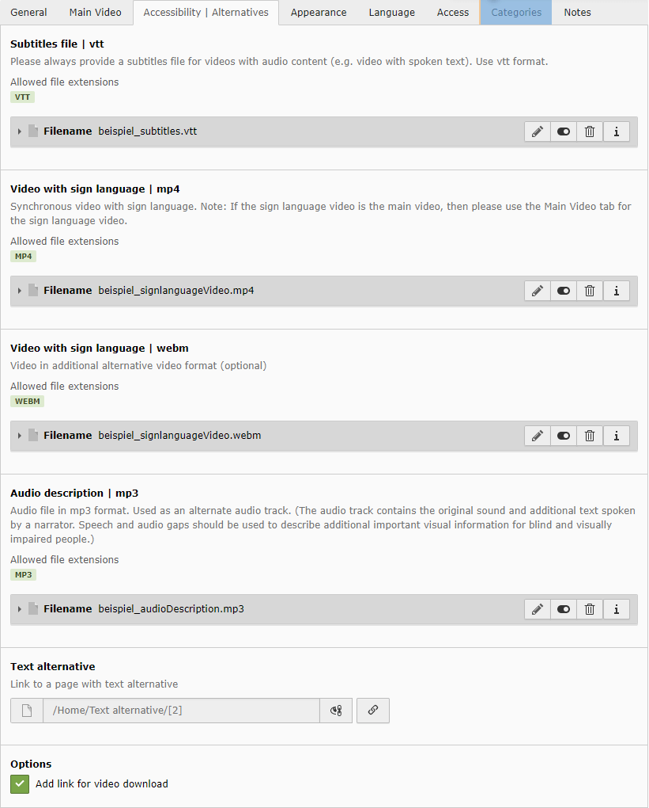
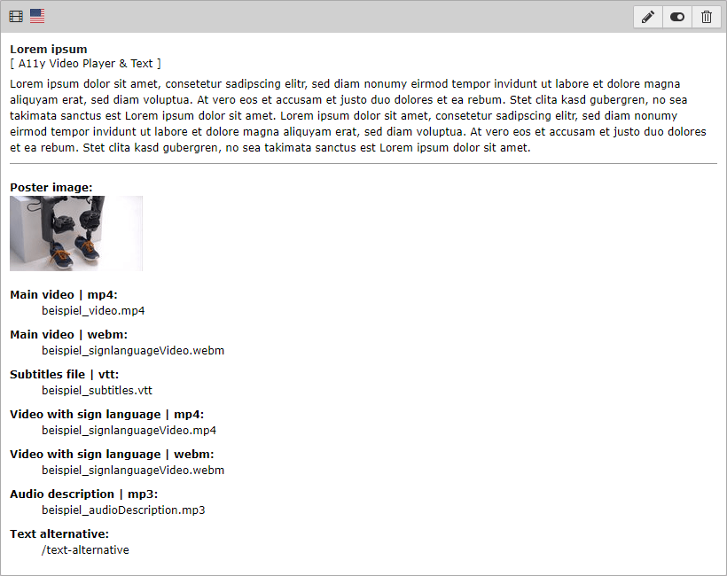

.. include:: ../../Includes.rst.txt

========================
A11y Video Player & Text
========================

Accessible video player (local file resources)

Tab General
===========

This content element supports data fields und settings, which are known from any
standard content elements e.g. *Text & Media*.

-  Header (with Type, Align, Date, Link, Subheader)
-  Text (ck-editor)

Tab Main Video
==============

Language (controls, subtitles)
   Select the language of the controls and the subtitles file (if available) of
   the video player here.

   The *Default* setting means that the settings on the page are used
   automatically.

   You can choose another language from the list. Only the languages
   in the list are supported.

Video position
   Set the position of the video relative to the optional text.
   (left, right, below, above)

Video width
   The video can take up 50% or 100% of the available container width.

Poster image
   Please provide a poster image. (e.g. a good video snapshot with the same
   aspect ratio 16:9)

Main video | mp4
   Please use the codec H.264 for the mp4 video. All current web browsers can
   play this. This video is therefore mandatory.

Main video | webm
   Video in additional alternative video format. (optional)

----

Tab Accessibility | Alternatives
================================

Here you can specify alternatives to the main video. Use it to improve
accessibility.

Video with sign language | mp4
   Synchronous video with sign language.

   A typical sign language video shows the original video in the background and
   the sign language interpreter in the foreground.

   Note: If the sign language video is the main video, then please use the
   Main Video tab for the sign language video.

Video with sign language | webm
   Video in additional alternative video format (optional)

   Note: This video will be ignored if you don't specify a mp4 video.

Audio description | mp3
   Audio file in mp3 format. Used as an alternative audio track.

   The audio track contains the original sound and additional text spoken by
   a narrator. Speech and audio gaps can be used to describe additional
   important visual information for blind and visually impaired people.

Text alternative
   Link to a page with text alternative.

----

Tab Appearance
==============

This content element supports data fields und settings, which are known from any
standard content elements e.g. *Text & Media*.

-  Layout
-  Frame
-  Space Before
-  Space After

All settings are optional.

.. figure:: ../../Images/VideoPlayerTabAppearance.png
   :width: 820
   :alt: screen shot of tab appearance

Backend Preview
===============

