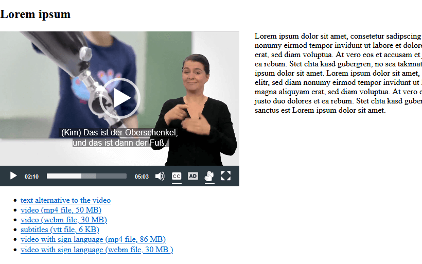

.. include:: Includes.rst.txt

.. _start:

=======================================================================
Accessible video player based on MediaElement.js, A11y Plugin and Fluid
=======================================================================

:Extension key:
   a11y_me_video

:Package name:
   iundd/a11y_me_video

:Version:
   |release|

:Language:
   en

:Author:
   Robert Pudenz

:Company:
   dreistrom.land AG

:E-Mail:
   r.pudenz@dreistrom.land

:Repository:
   `<https://github.com/iundd/a11y_me_video>`__

:TER:
   `<https://extensions.typo3.org/extension/a11y_me_video>`__

:License:
   This document is published under the
   `Creative Commons BY 4.0 <https://creativecommons.org/licenses/by/4.0/>`__
   license.

:Rendered:
   |today|

----

Accessible video player based on MediaElement.js, A11y Plugin and Fluid.

The new content element supports many features:

-  supports two video formats: mp4 and additional webm
-  customizable through fluid templates, sass, css and javascript
-  supports accessibility by being able to **optionally** include different alternatives to the main video

   -  switchable subtitles (vtt file)
   -  switchable video with sign language (mp4 file, additional webm file)
   -  switchable alternative audio track with audio description (mp3 file)
   -  link to a page with text alternative
   -  video download links

-  supports poster image
-  supports data fields, settings and CSS classes, which are known from any
   standard content elements e.g. *Text & Media*.

   -  header (header, type, align, date, link, subheader)
   -  text (ck-editor)
   -  content element layout (layout, frame, space before, space after)

-  video player based on MediaElement.js and A11y plugin
-  control via keyboard, mouse and touch
-  keyboard focus highlight
-  screen reader support with wai-aria
-  24 frontend languages
-  video width (50%,100%) and video position (relative to text block)
-  full screen mode available
-  automatically adapts to the screen width

   video player in frontend view

MediaElement.Js
===============

Video player based on MediaElement.js and A11y Plugin.js (Aktion Mensch Plugin):

*  MediaElements.js

   *  `Homepage <https://www.mediaelementjs.com/>`__
   *  `<https://github.com/mediaelement/mediaelement>`__

*  A11y Plugin (Aktion Mensch Plugin)

   *   `Videos für alle (german) <https://www.aktion-mensch.de/inklusion/barrierefreiheit/barrierefreier-videoplayer>`__
   *   `<https://github.com/mediaelement/mediaelement-plugins>`__
   *   `<https://github.com/mediaelement/mediaelement-plugins/tree/master/dist/a11y>`__

----

Table of Contents
"""""""""""""""""

.. toctree::
   :maxdepth: 5
   :titlesonly:

   AdministratorManual/Index
   EditorManual/Index

.. Meta Menu

.. toctree::
   :hidden:

   Sitemap
   genindex
