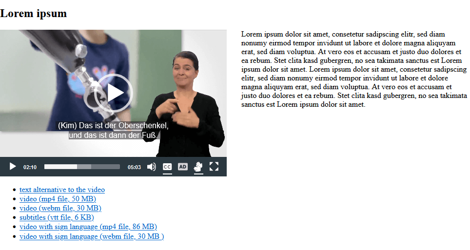
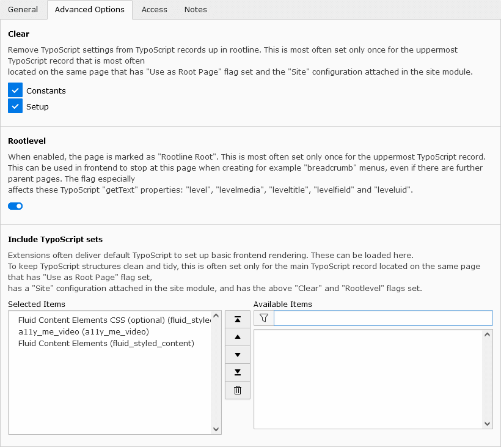
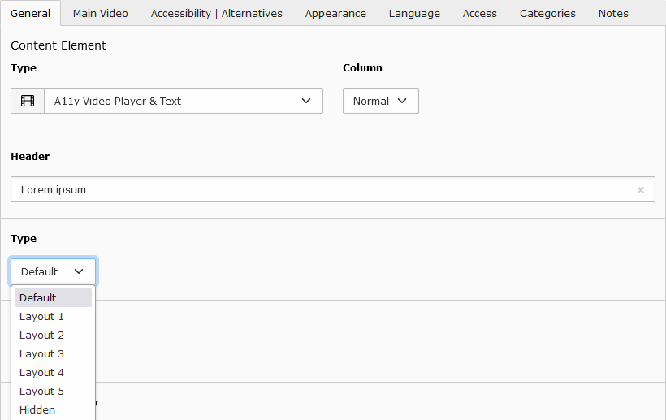
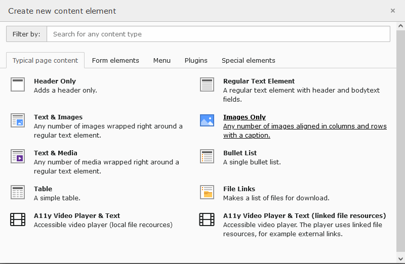
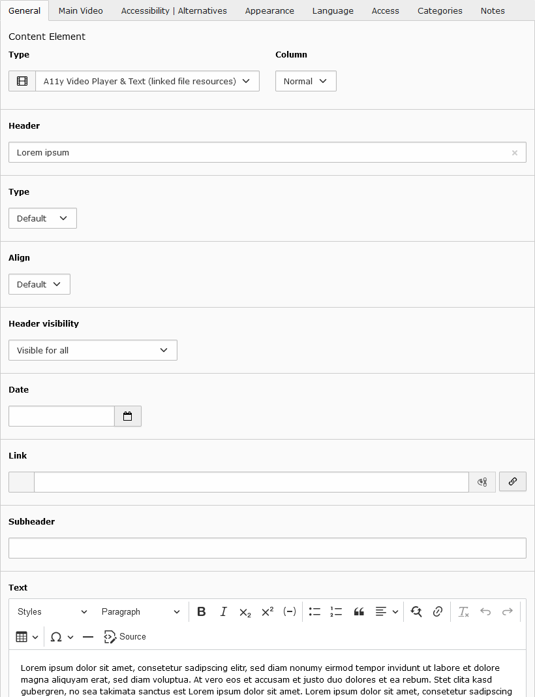
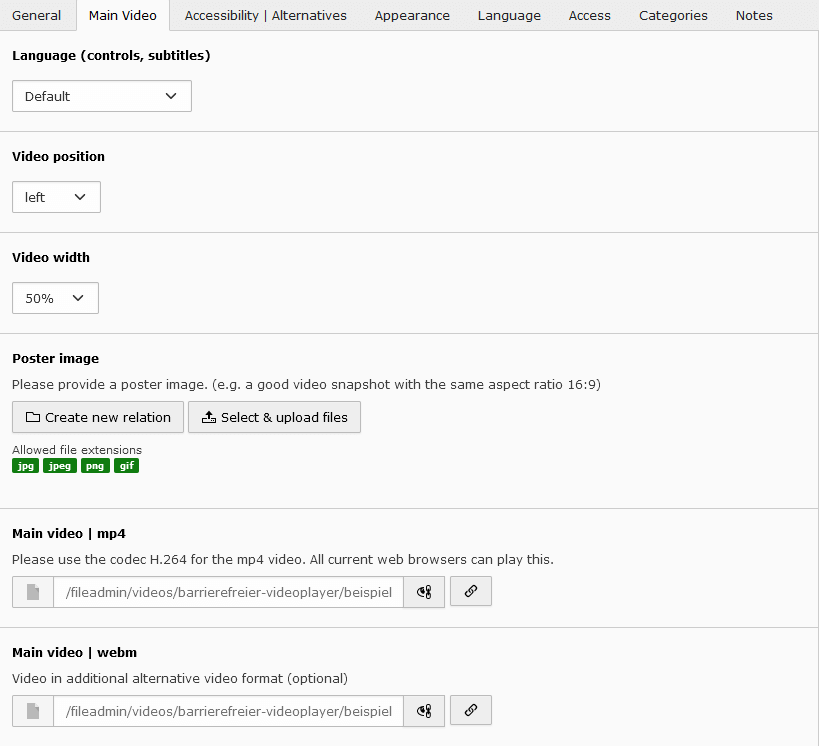
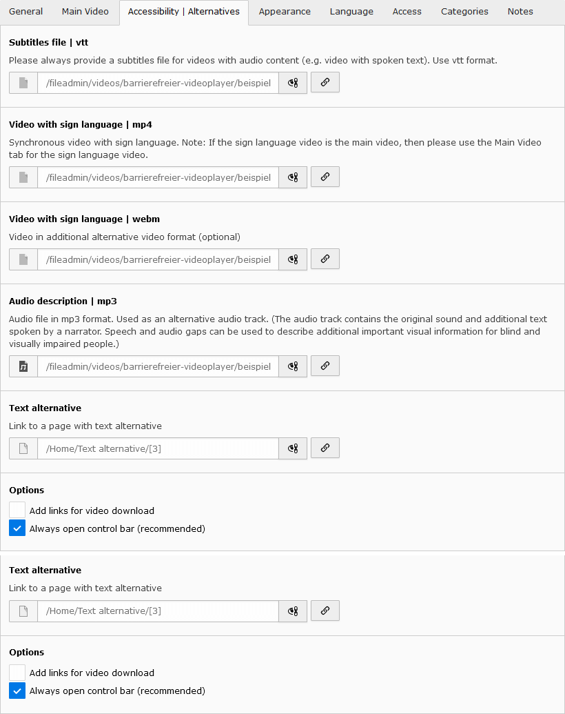
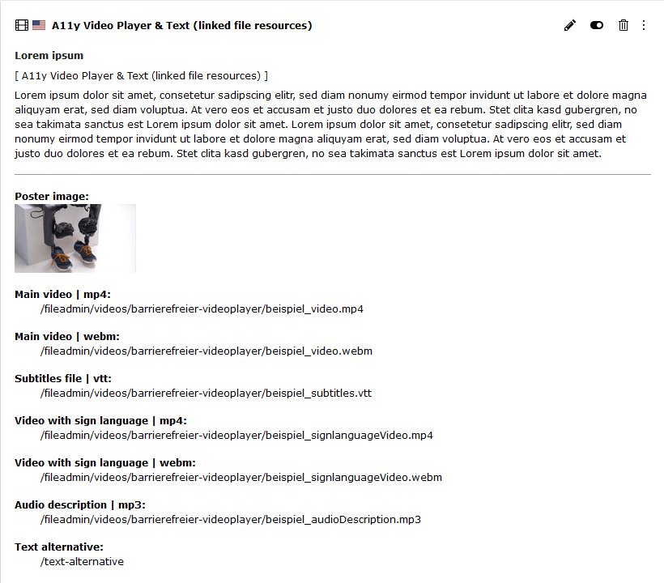

# Accessible video player based on MediaElement.js, A11y Plugin and Fluid.

### The new content element supports many features:

* supports two video formats: mp4 and additional webm
* customizable through fluid templates, sass, css and javascript
* supports accessibility by being able to **optionally** include different alternatives to the main video
  * switchable subtitles (vtt file)
  * switchable video with sign language (mp4 file, additional webm file)
  * switchable alternative audio track with audio description (mp3 file)
  * link to a page with text alternative
  * video download links
* supports poster image 
* supports data fields, settings and CSS classes, which are known from any
  standard content elements e.g. *Text & Media*.
  * header (header, type, align, date, link, subheader)
  * text (ck-editor, video position: left, right, above, below)
  * content element layout (layout, frame, space before, space after)
* video player based on MediaElement.js and A11y plugin
* control via keyboard, mouse and touch
* keyboard focus highlight
* screen reader support with wai-aria
* 24 frontend languages
* video width (50%,100%) and video position (relative to text block)
* full screen mode available
* automatically adapts to the screen width

----



----

|                 | URL                                                     |
|-----------------|---------------------------------------------------------|
| **Repository**  | https://github.com/iundd/a11y_me_video                  |
| **Read online** | https://docs.typo3.org/p/iundd/a11y-me-video/1.0/en-us/ |
| **TER**         | https://extensions.typo3.org/extension/a11y_me_video    |

## Installation

The extension needs to be installed like any other TYPO3 CMS extension. Get the
extension by one of the following methods.

### Installation using composer

The recommended way to install the extension is by using [Composer](https://getcomposer.org/).
In your composer based TYPO3 project root, just do

```sh
composer req iundd/a11y-me-video
```


### Latest version from git

You can get the latest version from git by using the git command:

```sh
git clone https://github.com/iundd/a11y_me_video.git
```


### Installation from TYPO3 Extension Repository (TER)

*  **Get it from the Extension Manager:** Switch to the module `Admin Tools > Extensions`.
*  Switch to `Get Extensions` and search for the extension key **a11y_me_video**.
*  Install the extension from the repository.


### Download from extensions.typo3.org

*  Go to [https://extensions.typo3.org/extension/a11y_me_video](https://extensions.typo3.org/extension/a11y_me_video)
   and get the current version by downloading the zip version


### Preparation: Include static TypoScript

The extension ships some TypoScript code which needs to be included.

1. Switch to the root page of your site.

2. Switch to the **Template module** and select *Info/Modify*.

3. Press the link **Edit the whole template record** and switch to the tab *Includes*.

4. Select **a11y_video_player** at the field *Include static (from extensions):*
   
   For some css classes to work, you also need to select **Fluid Content Elements CSS (optional)**



### Versioning

This project uses [semantic versioning](https://semver.org) which means that

*  **bugfix updates** (e.g. 1.0.0 => 1.0.1) just include small bugfixes or
   security relevant stuff without breaking changes,
*  **minor updates** (e.g. 1.0.0 => 1.1.0) include new features and smaller
   tasks without breaking changes and
*  **major updates** (e.g. 1.0.0 => 2.0.0) contain breaking changes which can be
   refactorings, features or bugfixes.


## Configuration und Customisation

### Overriding templates

**EXT:a11y_me_video** is using Fluid as template engine.

This documentation won't bring you all information about Fluid but only the
most important things you need for using it. You can get
more information in the section 
[Fluid templates of the Sitepackage tutorial](https://docs.typo3.org/m/typo3/tutorial-sitepackage/main/en-us/FluidTemplates/).
A complete reference of Fluid ViewHelpers provided by TYPO3 can be found in the [Fluid ViewHelper Reference](https://docs.typo3.org/other/typo3/view-helper-reference/main/en-us/)

#### Change the templates using TypoScript constants

Like any Extbase based extension, you can find the templates in the directory `EXT:a11y_me_video/Resources/Private/`.

If you want to change a template, copy the desired files to the directory where you store the templates.

We suggest that you use a sitepackage extension. Learn how to create a [sitepackage extension](https://docs.typo3.org/m/typo3/tutorial-sitepackage/main/en-us/).

```typoscript
plugin.tx_a11ymevideo {
    view {
        templateRootPath = EXT:mysitepackage/Resources/Private/Extensions/a11y_me_video/Templates/
        partialRootPath = EXT:mysitepackage/Resources/Private/Extensions/a11y_me_video/Partials/
        layoutRootPath = EXT:mysitepackage/Resources/Private/Extensions/a11y_me_video/Layouts/
    }
}
```

### CSS and Javascript Assets

CSS and Javascript files are integrated via the fluid partial `Resources/Private/Partials/Assets.html`.

e.G.
```xml
<f:asset.css identifier="a11yMeVideo_PlayerCss" href="EXT:a11y_me_video/Resources/Public/StyleSheets/videoPlayer.min.css"></f:asset.css>
```

If necessary, you can integrate your own modified files from your site package extension here.

e.G.
```xml
<f:asset.css identifier="a11yMeVideo_PlayerCss" href="EXT:my_extension/Resources/Public/StyleSheets/videoPlayer.min.css"></f:asset.css>
```

#### Change CSS

You can adapt the CSS to your own needs. You can use the existing CSS or SCSS files as base. Copy the file to your own
site package and include them with the alternative path.

You can find the original files here:

* EXT:a11y_me_video/Resources/Public/StyleSheets/
* EXT:a11y_me_video/Resources/Private/Scss/

##### Example: Change background color of video and controls (css or scss)

override css:
```css
   /* background color video */
   .a11y-me-videoplayer video {
      background-color: #2b3840;
   }

   /* background color controls */
   .a11y-me-videoplayer.active-controls .mejs__controls:not([style*="display: none"])  {
      background-color: #2b3840;
   }
```   

change scss variables (EXT:a11y_me_video/Resources/Private/Scss/_variables.scss)
```
   $a11y-video-outline-color : white;
   $a11y-video-controls-bg   : #2b3840;
```
**Note**:The color contrast (foreground to background) for controls must be at least 4.5:1.

* [Contrast Checker](https://webaim.org/resources/contrastchecker)
* [WCAG Criterion 1.4.3: Contrast (Minimum)](https://www.w3.org/WAI/WCAG21/Understanding/contrast-minimum.html)
* [WCAG Criterion 1.4.11: Non-text Contrast](https://www.w3.org/WAI/WCAG21/Understanding/non-text-contrast)

##### Javascript Sources

| JavaScript source file(s)                                                                          | Description                                     |
|----------------------------------------------------------------------------------------------------|-------------------------------------------------|
| EXT:a11y_me_video/Resources/Public/JavaScript/Vendor/mediaelement/build/mediaelement-and-player.js | MediaElements.js player                         |
| EXT:a11y_me_video/Resources/Public/JavaScript/Vendor/mediaelement/build/lang.advanced/*.js         | extended language files for player              |
| EXT:a11y_me_video/Resources/Public/JavaScript/Vendor/mediaelement-plugins/dist/a11y/a11y.js        | a11y plugin for subtitles und audio description |
| EXT:a11y_me_video/Resources/Public/videoPlayer.js                                                  | starts init mediaelement players & some fixes   |


### Override TypoScript settings

#### Change default header type

This setting determines which heading type is used when selecting *default* in the backend content module.

The default header type is 2 (= h2 header).

```typoscript
   tt_content.a11ymevideo_videoplayer {
       variables {
           defaultHeaderType.value = 2
       }
   }

   tt_content.a11ymevideo_videoplayer2 {
       variables {
           defaultHeaderType.value = 2
       }
   }
```



## Add video player module to a page 

Select **A11y Video Player & Text** or **A11y Video Player & Text (linked file resources)**:



## Content-Element: A11y Video Player & Text 

Accessible video player (local file resources)

### Tab General

This content element supports data fields und settings, which are known from any
standard content elements e.g. *Text & Media*.

* Header (with Type, Align, Date, Link, Subheader)
* Text (ck-editor)


### Tab Main Video

* Language (controls, subtitles)
  * Select the language of the controls and the subtitles file (if available) of the video player here.

    The *Default* setting means that the settings on the page are used automatically.

    You can choose another language from the list. Only the languages in the list are supported.
* Video position
  * Set the position of the video relative to the optional text. (left, right, below, above)
* Video width
  * The video can take up 50% or 100% of the available container width.
* Poster image
  * Please provide a poster image. (e.g. a good video snapshot with the same aspect ratio 16:9)
* Main video | mp4
  * Please use the codec H.264 for the mp4 video. All current web browsers can play this.
    This video is therefore mandatory.
* Main video | webm
  * Video in additional alternative video format. (optional)


### Tab Accessibility | Alternatives

Here you can specify alternatives to the main video. Use it to improve accessibility.

* Video with sign language | mp4
  * Synchronous video with sign language.
  
    A typical sign language video shows the original video in the background and the sign language interpreter in the
    foreground.

    Note: If the sign language video is the main video, then please use the Main Video tab for the sign language video.
* Video with sign language | webm
  * Video in additional alternative video format (optional)

    Note: This video will be ignored if you don't specify a mp4 video.
* Audio description | mp3
  * Audio file in mp3 format. Used as an alternative audio track.

    The audio track contains the original sound and additional text spoken by a narrator. Speech and audio gaps can
    be used to describe additional important visual information for blind and visually impaired people.
* Text alternative
  * Link to a page with text alternative.


### Tab Appearance

This content element supports data fields und settings, which are known from any
standard content elements e.g. *Text & Media*.

* Layout
* Frame 
* Space Before 
* Space After

All settings are optional.


### Backend Preview


----
----

## Content-Element: A11y Video Player & Text (linked file resources)

Accessible video player. The player uses linked file resources, for example external links.

### Tab General

This content element supports data fields und settings, which are known from any
standard content elements e.g. *Text & Media*.

* Header (with Type, Align, Date, Link, Subheader)
* Text (ck-editor)



### Tab Main Video

* Language (controls, subtitles)
    * Select the language of the controls and the subtitles file (if available) of the video player here.

      The *Default* setting means that the settings on the page are used automatically.

      You can choose another language from the list. Only the languages in the list are supported.
* Video position
    * Set the position of the video relative to the optional text. (left, right, below, above)
* Video width
    * The video can take up 50% or 100% of the available container width.
* Poster image
    * Please provide a poster image. (e.g. a good video snapshot with the same aspect ratio 16:9)
* Main video | mp4
    * Please use the codec H.264 for the mp4 video. All current web browsers can play this.
      This video is therefore mandatory.
* Main video | webm
    * Video in additional alternative video format. (optional)



### Tab Accessibility | Alternatives

Here you can specify alternatives to the main video. Use it to improve accessibility.

* Video with sign language | mp4
    * Synchronous video with sign language.

      A typical sign language video shows the original video in the background and the sign language interpreter in the foreground.

      Note: If the sign language video is the main video, then please use the Main Video tab for the sign language video.
* Video with sign language | webm
    * Video in additional alternative video format (optional)

      Note: This video will be ignored if you don't specify a mp4 video.
* Audio description | mp3
    * Audio file in mp3 format. Used as an alternative audio track.

      The audio track contains the original sound and additional text spoken by a narrator. Speech and audio gaps can
      be used to describe additional important visual information for blind and visually impaired people.
* Text alternative
  * Link to a page with text alternative.



### Tab Appearance

This content element supports data fields und settings, which are known from any
standard content elements e.g. *Text & Media*.

* Layout
* Frame
* Space Before
* Space After

All settings are optional.


### Backend Preview



## Examples File

Here you will find a few test files that you can use to test and better understand the function of the player.

The main video, the sign language video and the mp3 file with audio description must be in sync.
This means that they all have the same timeline, so that you can easily switch between them at any time.

A typical sign language video shows the original video in the background and the sign language interpreter
in the foreground.

The audio description is used as an alternative audio track. The audio track contains the original sound and additional 
text spoken by a narrator. Speech and audio gaps can be used to describe additional important visual information
for blind and visually impaired people.

**Warning**: Please use the files only for testing and not for publishing on your website.
We have taken the following url addresses from the a11y-plugin's demo code and can therefore not provide any information
about the copyright (https://github.com/mediaelement/mediaelement-plugins/blob/master/demo/a11y.html).
Use at your own risk.

----

* Main video | mp4
  * https://video.aktion-mensch.de/magnolia/aktion-mensch_beispiel_video.mp4
* Main video | webm
  * https://video.aktion-mensch.de/magnolia/aktion-mensch_beispiel_video.webm
* Subtitles file | vtt:
  * https://video.aktion-mensch.de/magnolia/aktion-mensch-videoplayer/aktion-mensch_beispiel/aktion-mensch_beispiel.vtt
  
  * **Note:** Due to server policy, this URL cannot be used directly. Save the file on your web server and integrate it locally.
* Video with sign language | mp4:
  * https://video.aktion-mensch.de/magnolia/aktion-mensch-videoplayer/aktion-mensch_beispiel/aktion-mensch_beispiel_signlanguageVideo.mp4
* Video with sign language | webm:
  * https://video.aktion-mensch.de/magnolia/aktion-mensch-videoplayer/aktion-mensch_beispiel/aktion-mensch_beispiel_signlanguageVideo.webm
* Audio description | mp3:
  * https://video.aktion-mensch.de/magnolia/aktion-mensch_beispiel_audioDescription.mp3

## MediaElement.Js

Video player based on MediaElement.js and A11y Plugin.js (Aktion Mensch Plugin):

* MediaElements.js
  *  [Homepage](https://www.mediaelementjs.com)
  *  https://github.com/mediaelement/mediaelement
* A11y Plugin (Aktion Mensch Plugin)
  *  [Videos für alle (german)](https://www.mediaelementjs.com/)
  *  https://github.com/mediaelement/mediaelement-plugins
  *  https://github.com/mediaelement/mediaelement-plugins/tree/master/dist/a11y
